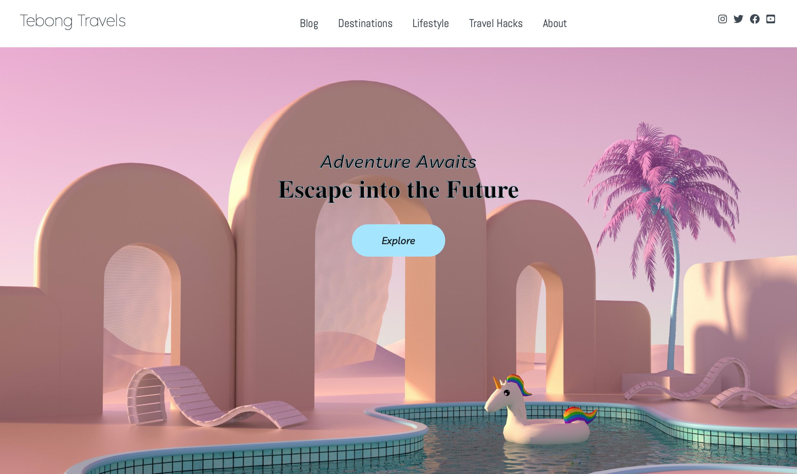

  <h3>
    <a href="https://osaze-ai.github.io/travel-blog/" color="white">
      Live
    </a>
     | 
    <a href="">
      Code
    </a>

# Tebong Travels 

Travel Blog 

## Introduction

"Tebong Travels" is a project where I develop my css, html and JS skills. I have created a fully responsive website design with an owl carousel that has a smartSpeed of 1200 and dotsSpeed of 1000. With these values the owl carousel transitions smoothly whilst the dotSpeed controls the sliding speed when you click on the arrow button. 

## Website

You can explore this webpage by clicking along the navigation bar which changes to a midnight blue upon hovering across each nav link. Under the site title the Explore button has a rgb colour of 164, 229 and 255. Whilst moving the pointer over the button the text becomes transparent with a border of 1px solid varable(white). 

To create the website I used the following:

- Media query
- CSS variables
- Flexbox
- Responsive multi-column layout
- Scrolling animation

## Code I am proud of

For a great user experience I created a smooth transition carousel with dotSpeed to control the arrow button. This can be found in the main JS folder <link rel="JS" href="./main.js" />

## Useful resources

1. <a href="https://owlcarousel2.github.io/OwlCarousel2/">Owl Carousel 2</a> - Touch enabled jQuery plugin that lets you create a beautiful responsive carousel slider.
2. <a href="https://fontawesome.com/">Font Awsome</a> - Icon library and toolkit. 
